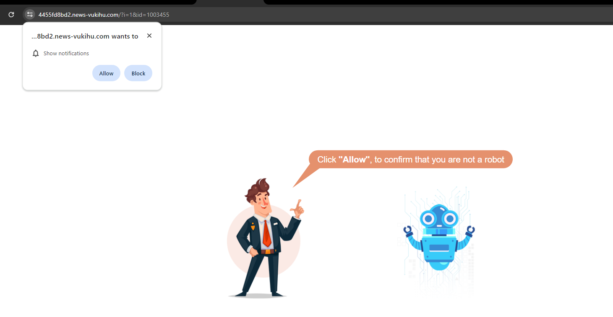

# Seed Id Guide

## Context:

We are working on a seed database to enable our AI to use image recognition to
identify a seed. Therefor, we were hoping to obtain some help from [Seed Id
Guide](https://seedidguide.idseed.org/) because they already have a database
(with content) about multiple seeds. Their help would save us tremendous work
time by not having to fully structurize our DB and populating it.

## Security Issue

While diving into the website we realize it might already be compromised. It
seems the website has been intected and now randomly redirects you to a
malicious website. 

### Plugins
It seems the wordpress website is built with 44 plugins. However, 31 of them are not up to date **including multiple security plugins**.

Neglecting to keep your WordPress plugins updated is like leaving the doors
unlocked on your website. These plugins are designed to enhance functionality
and security, but when left outdated, they become vulnerable to exploitation by
hackers. Malicious actors actively search for outdated plugins, as they often
contain known vulnerabilities that can be exploited to inject malware into your
website. Once infiltrated, malware can wreak havoc, causing your site to display
unwanted ads, redirect visitors to malicious sites, or even steal sensitive
information. Regularly updating your plugins is vital in maintaining the
integrity and security of your website, fortifying it against potential cyber
threats.

| Plugin Name                                     | Current Version | Latest Version | Known Vulnerability |
|-------------------------------------------------|-----------------|----------------|---------------------|
| Admin Columns Pro                               | 5.5.3           | 6.4.6          | 
| Admin Menu Editor                               | 1.10.4          | 1.12.1         |**:warning:YES** 
| Advanced Custom Fields PRO                      | 5.9.1           | 6.2.7          |**:warning:YES** 
| Advanced Google reCAPTCHA                       | 1.0.14          | 1.19           |
| Akismet Anti-Spam                               | 4.1.9           | 5.3.1          |
| Asgaros Forum                                   | 1.15.11         | 2.8.0          |**:warning:YES** 
| Bot Protection                                  | 5.16            | 5.47           |
| Breadcrumb NavXT                                | 6.6.0           | 7.3.0          |
| Breeze                                          | 2.0.31          | 2.1.4          |
| Disable Gutenberg                               | 2.8.1           | 3.1.1          | **:warning:YES**, no fixes yet, this enables XXS attack.
| Hide Drafts in Menus                            | 1.4.0           | 1.5.0          |
| Post Type Switcher                              | 3.2.1           | 3.3.1          |
| Post Types Order                                | 2.0             | 2.2            |
| Redirection                                     | 5.3.9           | 5.4.2          |
| ShortPixel Image Optimizer                      | 4.22.2          | 5.5.5          | **:warning:YES** 
| Simple Custom CSS and JS                        | 3.37            | 3.46           |
| Sucuri Security - Auditing, Malware Scanner... | 1.8.26          | 1.8.41         |
| Ultimate Member                                 | 2.1.21          | 2.8.3          |
| Ultimate Member - reCAPTCHA                     | 2.3.1           | 2.3.6          |
| White Label CMS                                 | 2.5             | 2.7.3          |
| Wordfence Security                              | 7.9.2           | 7.11.3         |
| WP Activity Log                                 | 4.4.3.2         | 4.6.4          |
| WP All Export Pro                               | 1.6.5           | -              | **:warning:YES** 
| WP All Import - User Import Add-On Pro          | 1.1.5           | 1.1.8          |
| WP All Import Pro                               | 4.6.7           | 4.8.6          |
| WP File Manager                                 | 7.1.6           | 7.2.4          |
| WP Mail SMTP                                    | 3.0.3           | 4.0.1          |
| WP Smart Preloader                              | 1.14            | 1.15.2         |
| WP-Stack                                        | 1.4.24          | 1.4.27         |
| Yoast Duplicate Post                            | 4.1.2           | 4.5            |
| Yoast SEO                                       | 20.3            | 22.2              |
