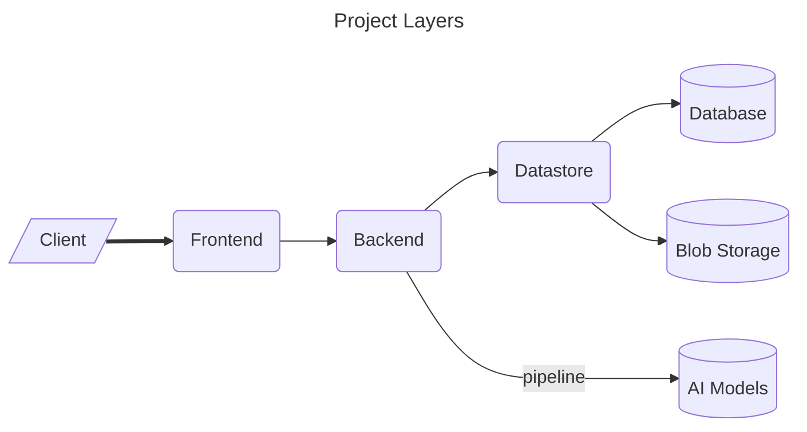
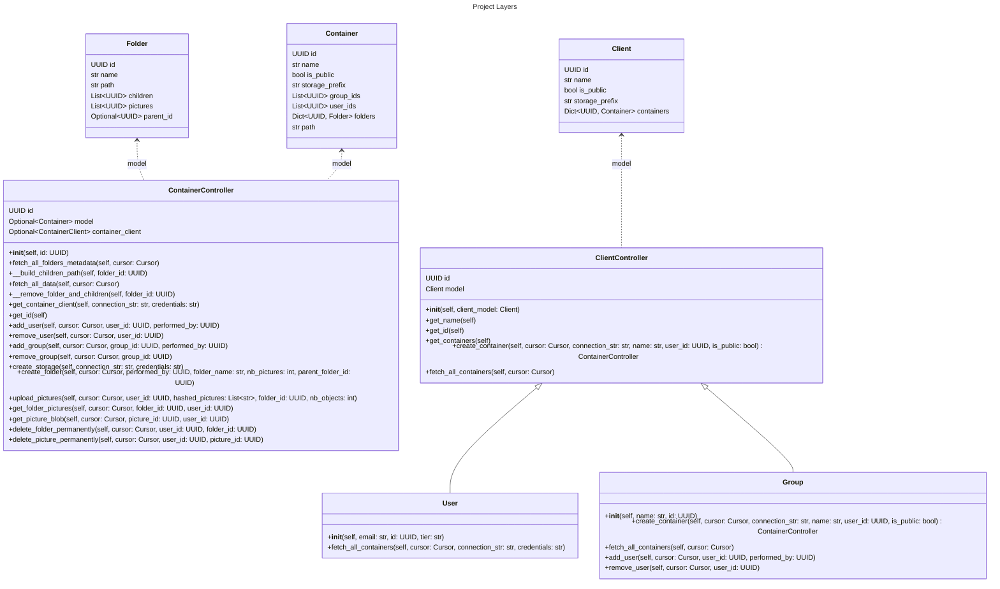
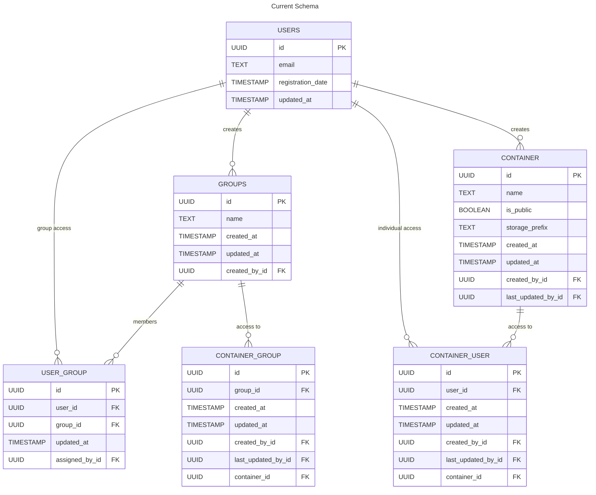

# Datastore

Welcome to the Datastore - the integral data management layer of the Nachet and
FertiScan solution serving a dual function role. As a central repository, it
efficiently manages multimedia storage in the blob storage server while
concurrently ensuring accurate metadata registration into a database server.

## Robust Multimedia Storage

The essential function of our Datastore is to manage the multimedia storage
effectively within the blob storage server. With support for a variety of media
formats and efficient indexing techniques, the smooth retrieval and access of
data are assured.

```Structure

Storage account:
│     
│  Container:
└───user-8367cc4e-1b61-42c2-a061-ca8662aeac37
|   | Folder:
│   └───folder-name/
|   |  |   fb20146f-df2f-403f-a56f-f02a48092167.json
│   |  │   f9b0ef75-6276-4ffc-a71c-975bc842063c.tiff
│   |  │   68e16a78-24bd-4b8c-91b6-75e6b84c40d8.tiff
│   |  |   ...
│   |  └─────────────
|   | Folder:
│   └───other-folder-name/
│      |   ...
│      └─────────────
|   Container:
└───user-...
|   └── ...
└──────────────────

```

## Efficient Metadata Registration

Coupled with managing multimedia storage, the Datastore also seamlessly
registers metadata into a database server. This double-edged approach ensures
not just efficient storage, but also the organization and easy accessibility of
your valuable data.



### Datastore module

The Datastore module assures the CRUD workflow of the following high level entitites.



## Database Architecture



  For more detail on each app database architecture go check [Nachet
  Architecture](../../nachet/doc/nachet-architecture.md) and [Fertiscan
  Architecture](../../fertiscan/doc/fertiScan-architecture.md).

### Global Needs

- A User must be able to take a picture on the app, it must be saved in the
  blob Storage and also tracked into the DB.

- A User can upload a batch on pictures.

- A User can verify the result of a picture that went through the pipeline and
  the changes are saved for training.

- A User can create a group of User

- A User can manage who (User & Group) has access to their containers
