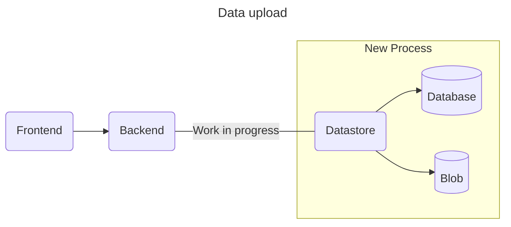
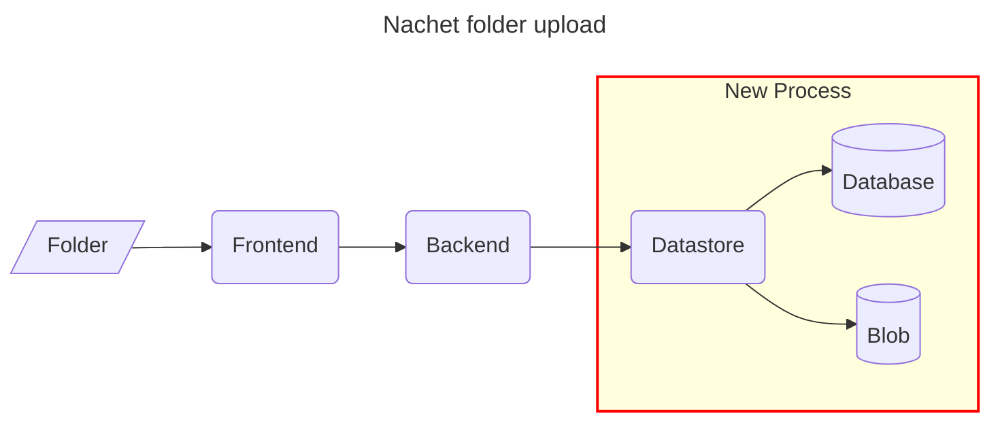

# Metadata importation

## Context

The Datastore receives from its Backend JSON files related to pictures which we
also have to register. Therefore, we would need a module in place to manipulate
all the JSON and format them for our DB needs. The modules needs to also be able
to rebuild a JSON to be used by the other layers (BE & FE)  

The following documentation provide an overview of the metadata importation
process . We outline each steps of the workflow, illustrating how data
progresses until it becomes usable by our applications.

Additionally, the upcoming process are showcased with the expected files
structure.



## Development

As explained in the context we aim to implement an architecture for user
uploads. This approach would allow to us add a data structure validator using
[Pydantic](https://docs.pydantic.dev/latest/). By implementing a validator, we
will be able to remove all manual metadata maintenance. Once the validation
process is complete, the upload process will come into play, enabling the
distribution of the files between the BLOB storage and a PostgreSQL database.

 We are currently improving the process to make it more efficient across all our
 project.



## Blob Storage

Finally the picture uploaded by the users will need to be stored in a blob
storage. Therefore we are using a Azure blob Storage account which currently
contains a list of containers used either for the users upload or our Data
scientists training sets. The current structure uses a tier in the container's
name.

```Structure

Storage account:
│     
│  Container:
└───user-8367cc4e-1b61-42c2-a061-ca8662aeac37
|   | Folder:
│   └───fb20146f-df2f-403f-a56f-f02a48092167/
│   |  │   f9b0ef75-6276-4ffc-a71c-975bc842063c.tiff
│   |  │   68e16a78-24bd-4b8c-91b6-75e6b84c40d8.tiff
│   |  |   ...
│   |  └─────────────
|   | Folder:
│   └───a6bc9da0-b1d0-42e5-8c41-696b86271d55/
│      |   ...
│      └─────────────
|   Container:
└───user-...
|   └── ...
└──────────────────

```

## Consequences

  Implementing this structure and introducing the new backend features will
  result in the following impact:

- **Automation of file structure maintenance:** This process will autonomously

  manage the file structure, eliminating the need for manual maintenance and
  reducing workload for the AI-Lab team.

- **Streamlined subscription key management:** The new feature will eliminate

  the need for email communication between users and the AI-Lab team for
  subscription keys. The system may automatically create and connect to the
  appropriate BLOB storage without user intervention. Consequently, manual
  creation of storage by the AI-Lab team will be unnecessary, and all keys will
  be securely stored in the database.

- **Enhanced security:** The removal of email exchanges between users and the

  development team represents a substantial improvement in security protocols.

- **Improved model tracking and training:** Storing user metadata will enable

  more effective tracking of model performance and facilitate better training
  strategies.

- **Automated metadata enrichment:** The process will enable the automatic

  addition of additional information to metadata, enhancing the depth of
  insights available.
  
Overall, this new feature will empowers the AI-Lab team to have better control
over the content fed to the models and ensures improved tool maintenance
capabilities in the future.
