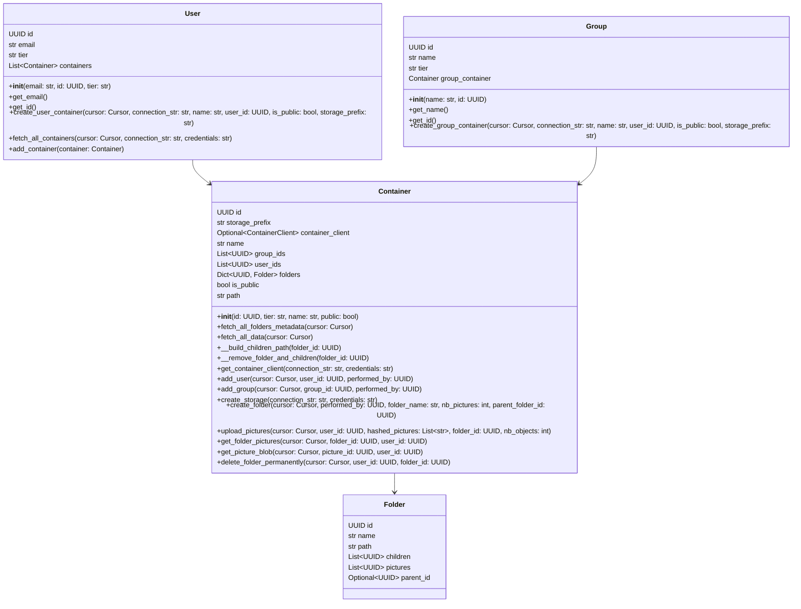
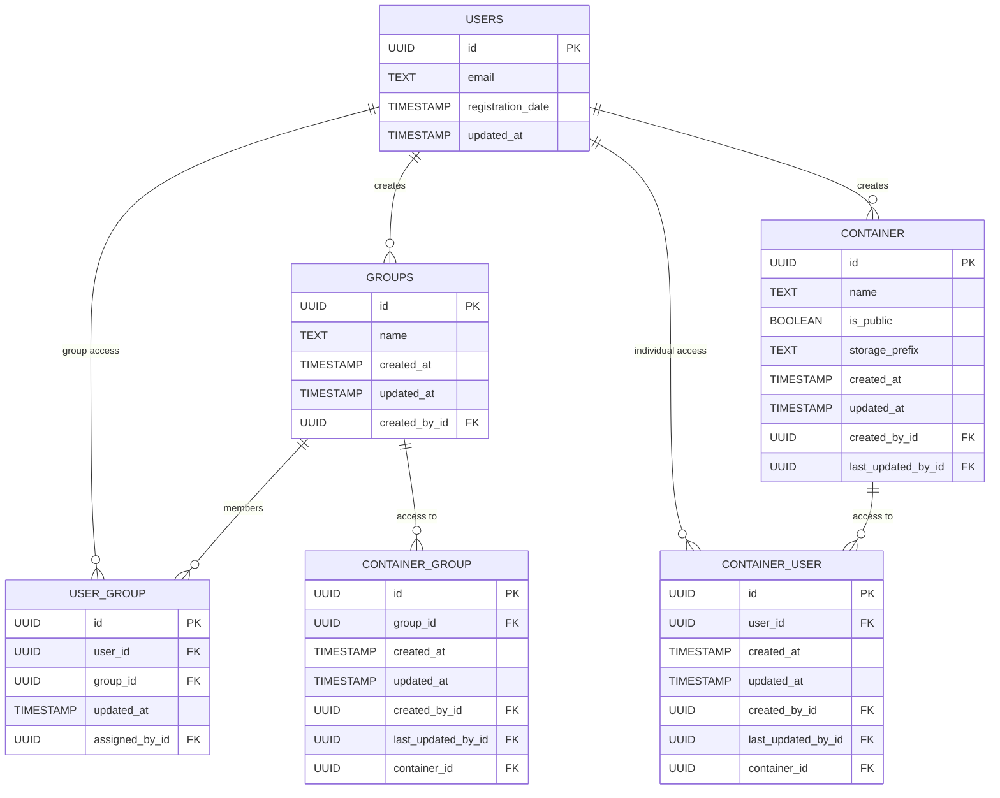
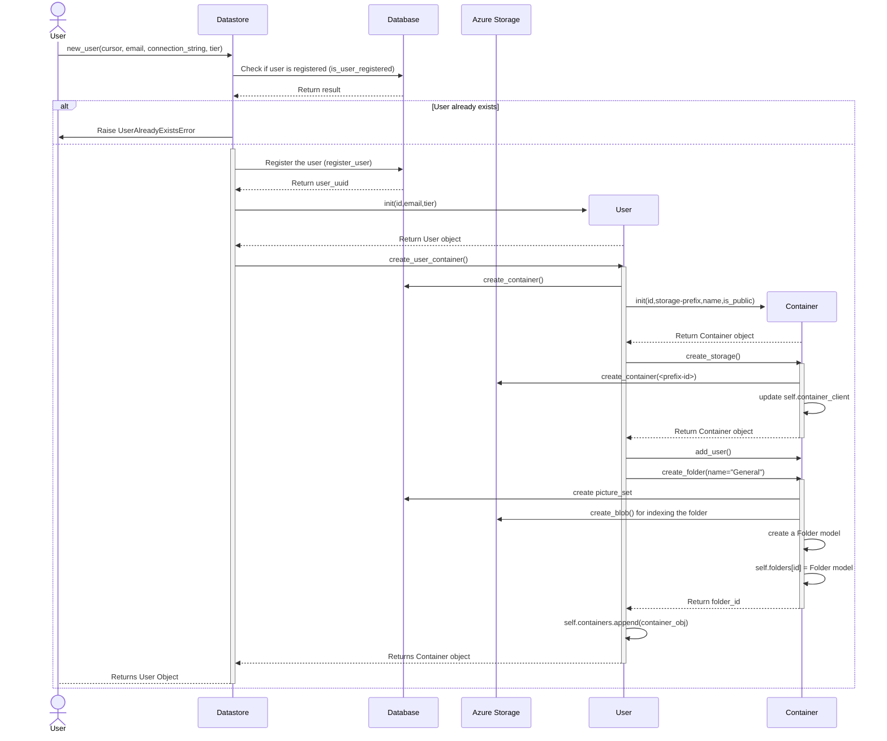
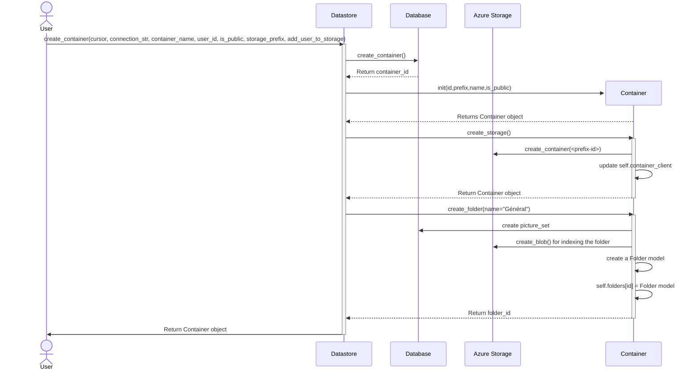

# Datastore module

## Module classes

```mermaid
classDiagram
    class Folder {
        UUID id
        str name
        str path
        List~UUID~ children
        List~UUID~ pictures
        Optional~UUID~ parent_id
    }
    class Container {
        UUID id
        str storage_prefix
        Optional~ContainerClient~ container_client
        str name
        List~UUID~ group_ids
        List~UUID~ user_ids
        Dict~UUID, Folder~ folders
        bool is_public
        str path
        +__init__(id: UUID, tier: str, name: str, public: bool)
        +fetch_all_folders_metadata(cursor: Cursor)
        +fetch_all_data(cursor: Cursor)
        +__build_children_path(folder_id: UUID)
        +__remove_folder_and_children(folder_id: UUID)
        +get_container_client(connection_str: str, credentials: str)
        +add_user(cursor: Cursor, user_id: UUID, performed_by: UUID)
        +add_group(cursor: Cursor, group_id: UUID, performed_by: UUID)
        +create_storage(connection_str: str, credentials: str)
        +create_folder(cursor: Cursor, performed_by: UUID, folder_name: str, nb_pictures: int, parent_folder_id: UUID)
        +upload_pictures(cursor: Cursor, user_id: UUID, hashed_pictures: List~str~, folder_id: UUID, nb_objects: int)
        +get_folder_pictures(cursor: Cursor, folder_id: UUID, user_id: UUID)
        +get_picture_blob(cursor: Cursor, picture_id: UUID, user_id: UUID)
        +delete_folder_permanently(cursor: Cursor, user_id: UUID, folder_id: UUID)
    }
    class User {
        UUID id
        str email
        str tier
        List~Container~ containers
        +__init__(email: str, id: UUID, tier: str)
        +get_email()
        +get_id()
        +create_user_container(cursor: Cursor, connection_str: str, name: str, user_id: UUID, is_public: bool, storage_prefix: str)
        +fetch_all_containers(cursor: Cursor, connection_str: str, credentials: str)
        +add_container(container: Container)
    }
    class Group {
        UUID id
        str name
        str tier
        Container group_container
        +__init__(name: str, id: UUID)
        +get_name()
        +get_id()
        +create_group_container(cursor: Cursor, connection_str: str, name: str, user_id: UUID, is_public: bool, storage_prefix: str)
    }

    Container --> Folder
    User --> Container
    Group --> Container

```    

## Module DB representation

```mermaid
erDiagram
    USERS {
        UUID id PK
        TEXT email
        TIMESTAMP registration_date
        TIMESTAMP updated_at
    }

    GROUPS {
        UUID id PK
        TEXT name
        TIMESTAMP created_at
        TIMESTAMP updated_at
        UUID created_by_id FK
    }

    USER_GROUP {
        UUID id PK
        UUID user_id FK
        UUID group_id FK
        TIMESTAMP updated_at
        UUID assigned_by_id FK
    }

    CONTAINER {
        UUID id PK
        TEXT name
        BOOLEAN is_public
        TEXT storage_prefix
        TIMESTAMP created_at
        TIMESTAMP updated_at
        UUID created_by_id FK
        UUID last_updated_by_id FK
    }

    CONTAINER_USER {
        UUID id PK
        UUID user_id FK
        TIMESTAMP created_at
        TIMESTAMP updated_at
        UUID created_by_id FK
        UUID last_updated_by_id FK
        UUID container_id FK
    }

    CONTAINER_GROUP {
        UUID id PK
        UUID group_id FK
        TIMESTAMP created_at
        TIMESTAMP updated_at
        UUID created_by_id FK
        UUID last_updated_by_id FK
        UUID container_id FK
    }

    USERS ||--o{ GROUPS : "creates"
    USERS ||--o{ USER_GROUP : "group access"
    GROUPS ||--o{ USER_GROUP : "members"
    USERS ||--o{ CONTAINER : "creates"
    USERS ||--o{ CONTAINER_USER : "individual access"
    CONTAINER ||--o{ CONTAINER_USER : "access to"
    GROUPS ||--o{ CONTAINER_GROUP : "access to"
```

## Create User

```mermaid
sequenceDiagram
    actor User
    participant App as Datastore
    participant DB as Database
    participant Azure as Azure Storage

    User ->> App: new_user(cursor, email, connection_string, tier)
    App ->> DB: Check if user is registered (is_user_registered)
    DB -->> App: Return result
    alt User already exists
        App ->> User: Raise UserAlreadyExistsError
    else
        Activate App
        App ->> DB: Register the user (register_user)
        DB -->> App: Return user_uuid
        create participant UC as User 
        App ->> UC: init(id,email,tier)
        UC -->> App: Return User object
        App ->> UC : create_user_container()
        Activate UC
        UC ->> DB: create_container()
        create participant Container as Container
        UC ->> Container: init(id,storage-prefix,name,is_public)
        Container -->>UC: Return Container object
        UC ->> Container: create_storage()
        Activate Container
        Container ->> Azure: create_container(<prefix-id>)
        Container ->> Container: update self.container_client
        Container -->>UC: Return Container object
        Deactivate Container
        UC ->> Container: add_user()
        UC ->> Container: create_folder(name="General")
        Activate Container
        Container ->> DB: create picture_set
        Container ->> Azure: create_blob() for indexing the folder
        Container ->> Container: create a Folder model
        Container ->>Container: self.folders[id] = Folder model
        Container -->>UC: Return folder_id
        deactivate Container
        UC ->> UC: self.containers.append(container_obj)
        UC -->> App: Returns Container object
        deactivate UC
        App --> User: Returns User Object
    
        Deactivate App
    end
```

## Create Container

```mermaid
sequenceDiagram
    actor User
    participant App as Datastore
    participant DB as Database
    participant Azure as Azure Storage

    User ->> App: create_container(cursor, connection_str, container_name, user_id, is_public, storage_prefix, add_user_to_storage)
    Activate App
    App ->> DB: create_container()
    DB -->> App: Return container_id
    create participant Container
    App ->> Container: init(id,prefix,name,is_public)
    Container -->> App: Returns Container object
    App ->> Container: create_storage()
    Activate Container
    Container ->> Azure: create_container(<prefix-id>)
    Container ->> Container: update self.container_client
    Container -->>App: Return Container object
    Deactivate Container
    App ->> Container: create_folder(name="Général")
    Activate Container 
    Container ->> DB: create picture_set
    Container ->> Azure: create_blob() for indexing the folder
    Container ->> Container: create a Folder model
    Container ->>Container: self.folders[id] = Folder model
    Container -->> App: Return folder_id
    deactivate Container
    App ->> User: Return Container object
    Deactivate App
```