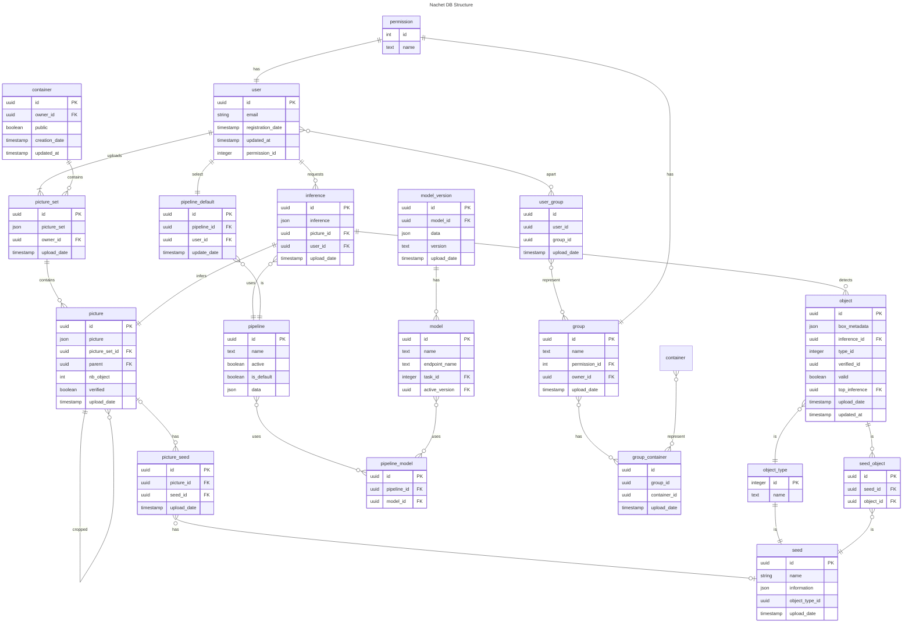

# Datastore

Welcome to the Nachet Datastore - the integral data management layer of the
Nachet solution serving a dual function role. As a central repository, it
efficiently manages multimedia storage in the blob storage server while
concurrently ensuring accurate metadata registration into a database server. 

## Robust Multimedia Storage 

The essential function of our Datastore is to manage the multimedia storage
effectively within the blob storage server. With support for a variety of media
formats and efficient indexing techniques, the smooth retrieval and access of
data are assured. 

```Structure

Storage account:
│     
│  Container:
└───user-8367cc4e-1b61-42c2-a061-ca8662aeac37
|   | Folder:
│   └───fb20146f-df2f-403f-a56f-f02a48092167/
|   |  |   fb20146f-df2f-403f-a56f-f02a48092167.json
│   |  │   f9b0ef75-6276-4ffc-a71c-975bc842063c.tiff
│   |  │   68e16a78-24bd-4b8c-91b6-75e6b84c40d8.tiff
│   |  |   ...
│   |  └─────────────
|   | Folder:
│   └───a6bc9da0-b1d0-42e5-8c41-696b86271d55/
│      |   ...
│      └─────────────
|   Container:
└───user-...
|   └── ...
└──────────────────

```

## Efficient Metadata Registration

Coupled with managing multimedia storage, the Nachet Datastore also seamlessly registers metadata into a database server. This double-edged approach ensures not just efficient storage, but also the organization and easy accessibility of your valuable data. 


##

