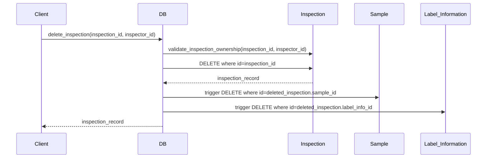
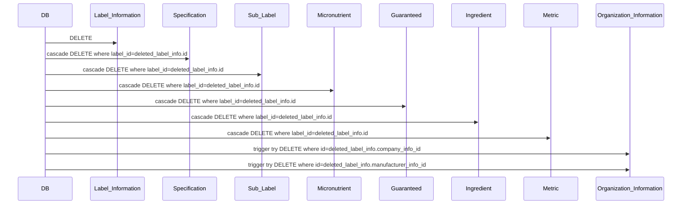
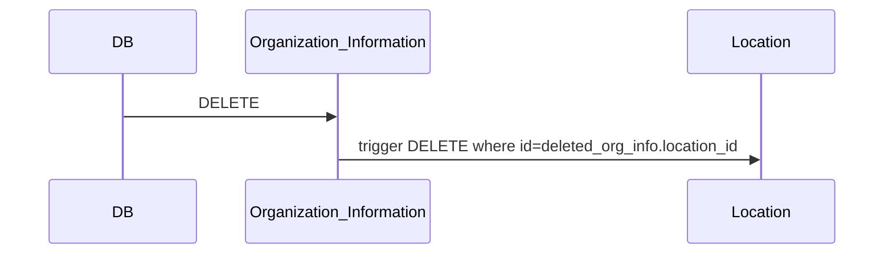
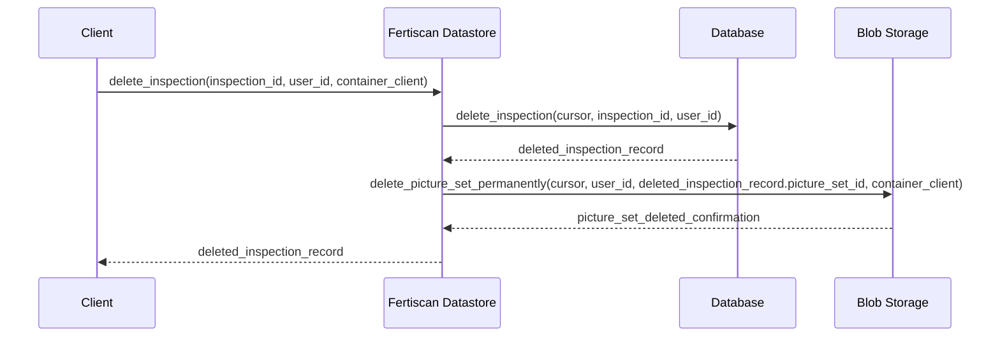

# Deleting an Inspection Record

## Sequence Diagram of the DB function

**Preconditions:**

- The inspection record must exist prior to the update.

**Postconditions:**

- The inspection record is deleted along with the underlying table records.







### Output JSON Format

```json
{
  "id": "uuid-of-deleted-inspection",
  "verified": false,
  "upload_date": "timestamp-of-upload",
  "updated_at": "timestamp-of-last-update",
  "inspector_id": "uuid-of-inspector",
  "label_info_id": "uuid-of-deleted-label-info",
  "sample_id": "uuid-of-deleted-sample",
  "picture_set_id": "uuid-of-picture-set",
  "fertilizer_id": "uuid-of-fertilizer"
}
```

## Sequence diagram of fertiscan datastore python function


