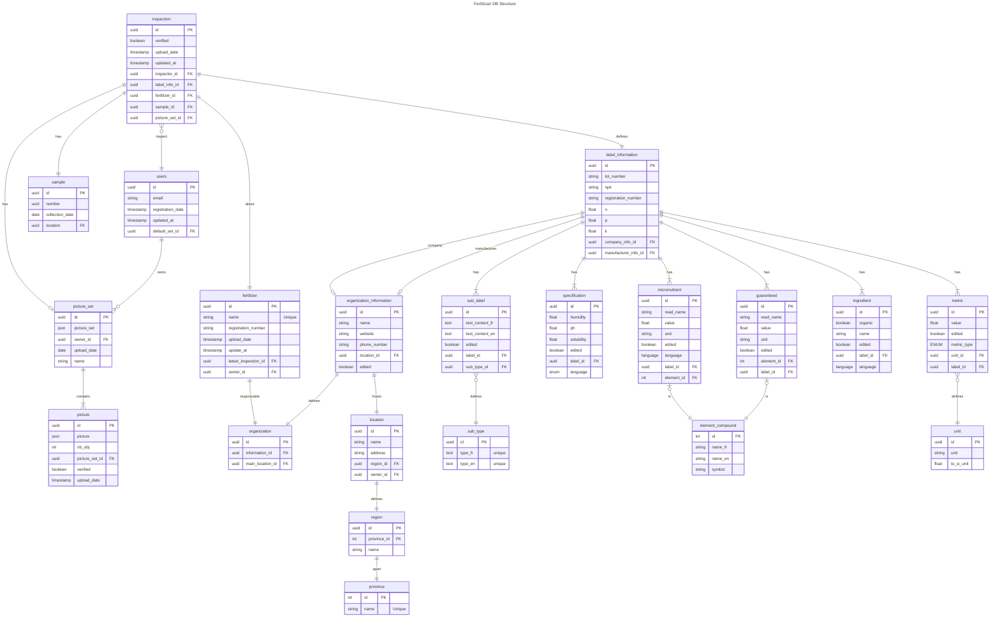

# FertiScan DB Architecture

## Needs

- A User must be able to take a picture on the app and it must be saved in the
  blob Storage.

- A User can do an analysis of a label during its inspection and must confirm
  the digitalization of the label_information.

- A User must be able to store its inspection about fertilizers

- A User must be able to to a search about fertilizer with filters

- The application needs to register the structure of the Blob Storage used.

This is the doc about the FertiScan Database Architecture

