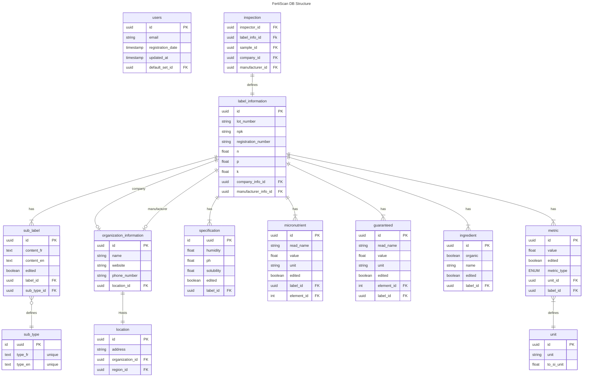
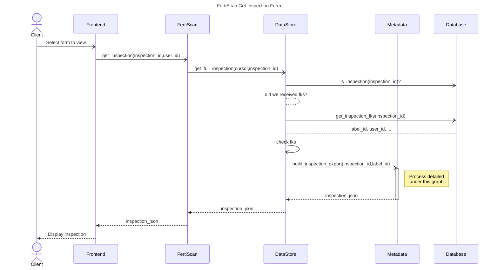
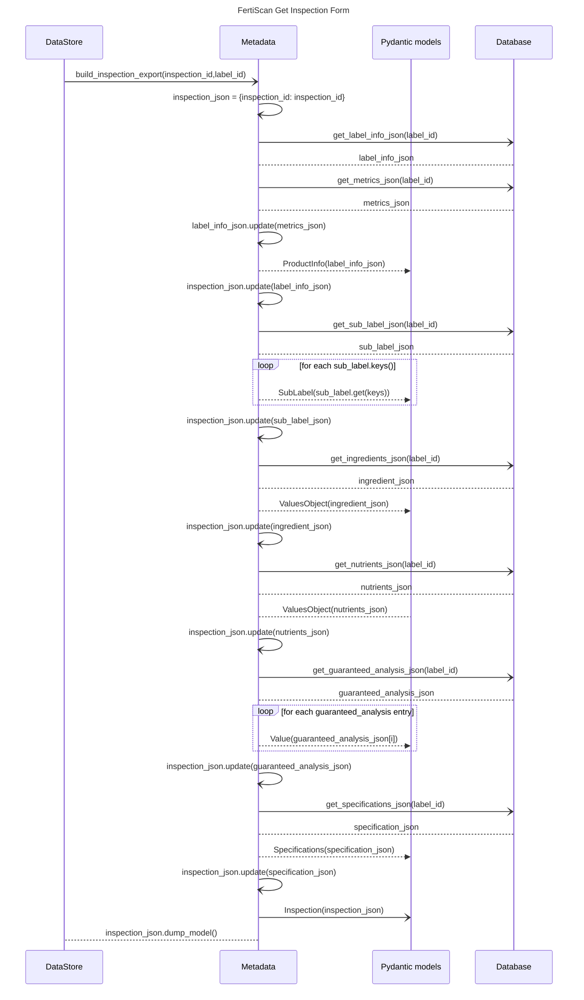

# Inspection fetching documentation

## Context

The User want to visualize the digitalization of a label, whether it is verified
or not. Therefore, the BE needs to be able to fetch an inspection in json format
from the database with only its id .

## Prerequisites

- The inspection id must be of a valid inspection

## Entity Used

## Sequence of Getting the inspection

## Sequence of build_inspection_export

