# Inspection registration Documentation

## Context

The User wants to digitalize a label picture on FertiScan. Therefore, the BE
uses it's models to digitalize the content and sends over a JSON with all the
information taken from the pictures. We need to parse the JSON, saves correctly
the information into the DB linked to the pictures received.

## Prerequisites

- The user must be already registered

## Entity Used

## Sequence of saving

### new_inspection()

```mermaid

 
sequenceDiagram

    participant User
  
    participant DB as Database
    participant Function as new_inspection()
    participant olap as OLAP dimension

    links olap: {"Inspection_Factual": "","Label_Dimension": "","Time_Dimension": ""}

    User->>DB: Call new_inspection()
    DB ->> Function: 
    activate Function

    Note over Function: Process Company Information
    Function->>DB: Call new_organization_info_located for Company
    DB-->>Function: Return company_id
    Function->>Function: Update input_json with company_id

    Note over Function: Process Manufacturer Information
    Function->>DB: Call new_organization_info_located for Manufacturer
    DB-->>Function: Return manufacturer_id
    Function->>Function: Update input_json with manufacturer_id

    Note over Function: Process Label Information
    Function->>DB: Call new_label_information
    DB -) olap: TRIGGER: Create new label_dimension
    DB-->>Function: Return label_info_id
    Function->>Function: Update input_json with label_info_id

    Note over Function: Process Weight Metrics
    loop For each weight record
        Function->>DB: Call new_metric_unit for Weight
        DB -) olap: TRIGGER: UPDATE label_dimension append weight_ids
        DB-->>Function: Return weight_id
    end

    Note over Function: Process Density Metric
    Function->>DB: Call new_metric_unit for Density
    DB -) olap: TRIGGER: UPDATE label_dimension append density_ids
    DB-->>Function: Return density_id

    Note over Function: Process Volume Metric
    Function->>DB: Call new_metric_unit for Volume
    DB -) olap: TRIGGER: UPDATE label_dimension append volume_ids
    DB-->>Function: Return volume_id

    Note over Function: Process Specifications
    loop For each specification record
        Function->>DB: Call new_specification
        DB -) olap: TRIGGER: UPDATE label_dimension append specification_ids
        DB-->>Function: Return specification_id
    end

    Note over Function: Process Ingredients
    loop For each ingredient record
        Function->>DB: Call new_ingredient
        DB -) olap: TRIGGER: UPDATE label_dimension append ingredient_ids
        DB-->>Function: Return ingredient_id
    end

    Note over Function: Process Sub Labels
    loop For each sub label record
        Function->>DB: Call new_sub_label
        DB -) olap: TRIGGER: UPDATE label_dimension append child_label_ids child_label = sub_label_type
        DB-->>Function: Return sub_label_id
    end

    Note over Function: Process Micronutrients
    loop For each micronutrient record
        Function->>DB: Call new_micronutrient
        DB -) olap: TRIGGER: UPDATE label_dimension append micronutrients_ids
        DB-->>Function: Return micronutrient_id
    end

    Note over Function: Process Guaranteed Analysis
    loop For each guaranteed analysis record
        Function->>DB: Call new_guaranteed_analysis
        DB -) olap: TRIGGER: UPDATE label_dimension append guaranteed_ids
        DB-->>Function: Return guaranteed_analysis_id
    end

    Note over Function: Insert Inspection
    Function->>DB: Insert into inspection
    DB-->>Function: Return inspection_id_value
    Function->>Function: Update input_json with inspection_id_value

    DB->>olap: TRIGGER: update inspection_factual SET original_dataset = input_json

    Function-->>User: Return input_json
    deactivate Function


```
