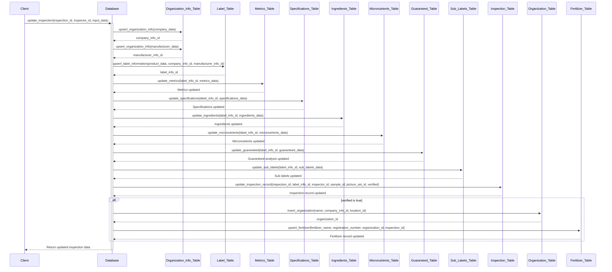

# Updating an Inspection Record

## Sequence Diagram

**Preconditions:**

- The inspection record must exist prior to the update.

**Postconditions:**

- Records for organizations, labels, metrics, specifications, ingredients,
  micronutrients, guaranteed analysis, sub-labels, and fertilizers are created
  or updated.
- The existing inspection record is updated with the latest information.



## Input and Output JSON Format

The input and output JSON formats for the `update_inspection` function are as
follows:

### Input JSON Format

```json
{
  "company": {
    "id": "66218ae7-0eba-48b4-a06b-b1563bd40f3e",
    "name": "GreenGrow Fertilizers Inc.",
    "address": "123 Greenway Blvd, Springfield IL 62701 USA",
    "website": "www.greengrowfertilizers.com",
    "phone_number": "+1 800 555 0199"
  },
  "product": {
    "k": 20.0,
    "n": 20.0,
    "p": 20.0,
    "id": "0dcab2ce-206a-4763-a7bb-838a30e227da",
    "npk": "20-20-20",
    "name": "SuperGrow 20-20-20",
    "metrics": {
      "volume": { "unit": "L", "value": 20.8 },
      "weight": [
        { "unit": "kg", "value": 25.0 },
        { "unit": "lb", "value": 55.0 }
      ],
      "density": { "unit": "g/cm³", "value": 1.2 }
    },
    "warranty": "Guaranteed analysis of nutrients.",
    "lot_number": "L987654321",
    "registration_number": "F12345678"
  },
  "cautions": {
    "en": [
      "Keep out of reach of children.",
      "Avoid contact with skin and eyes."
    ],
    "fr": [
      "Tenir hors de portée des enfants.",
      "Éviter le contact avec la peau et les yeux."
    ]
  },
  "first_aid": {
    "en": [
      "In case of contact with eyes, rinse immediately with plenty of water and seek medical advice."
    ],
    "fr": [
      "En cas de contact avec les yeux, rincer immédiatement à grande eau et consulter un médecin."
    ]
  },
  "ingredients": {
    "en": [
      { "name": "Bone meal", "unit": "%", "value": 5.0 },
      { "name": "Seaweed extract", "unit": "%", "value": 3.0 },
      { "name": "Humic acid", "unit": "%", "value": 2.0 },
      { "name": "Clay", "unit": null, "value": null },
      { "name": "Sand", "unit": null, "value": null },
      { "name": "Perlite", "unit": null, "value": null }
    ],
    "fr": [
      { "name": "Farine d'os", "unit": "%", "value": 5.0 },
      { "name": "Extrait d'algues", "unit": "%", "value": 3.0 },
      { "name": "Acide humique", "unit": "%", "value": 2.0 },
      { "name": "Argile", "unit": null, "value": null },
      { "name": "Sable", "unit": null, "value": null },
      { "name": "Perlite", "unit": null, "value": null }
    ]
  },
  "instructions": {
    "en": [
      "1. Dissolve 50g in 10L of water.",
      "2. Apply every 2 weeks.",
      "3. Store in a cool, dry place."
    ],
    "fr": [
      "1. Dissoudre 50g dans 10L d'eau.",
      "2. Appliquer toutes les 2 semaines.",
      "3. Conserver dans un endroit frais et sec."
    ]
  },
  "manufacturer": {
    "id": "0f2fe699-3484-4c77-b920-33c3716bcfe3",
    "name": "AgroTech Industries Ltd.",
    "address": "456 Industrial Park Rd, Oakville ON L6H 5V4 Canada",
    "website": "www.agrotechindustries.com",
    "phone_number": "+1 416 555 0123"
  },
  "inspection_id": "72437b2d-8f1e-4ad2-96f0-8a6b5e77f176",
  "verified": true,
  "micronutrients": {
    "en": [
      { "name": "Iron (Fe)", "unit": "%", "value": 0.1 },
      { "name": "Zinc (Zn)", "unit": "%", "value": 0.05 },
      { "name": "Manganese (Mn)", "unit": "%", "value": 0.05 }
    ],
    "fr": [
      { "name": "Fer (Fe)", "unit": "%", "value": 0.1 },
      { "name": "Zinc (Zn)", "unit": "%", "value": 0.05 },
      { "name": "Manganèse (Mn)", "unit": "%", "value": 0.05 }
    ]
  },
  "specifications": {
    "en": [{ "ph": 6.5, "humidity": 10.0, "solubility": 100.0 }],
    "fr": [{ "ph": 6.5, "humidity": 10.0, "solubility": 100.0 }]
  },
  "guaranteed_analysis": [
    { "name": "Total Nitrogen (N)", "unit": "%", "value": 20.0 },
    { "name": "Available Phosphate (P2O5)", "unit": "%", "value": 20.0 },
    { "name": "Soluble Potash (K2O)", "unit": "%", "value": 20.0 }
  ]
}
```
