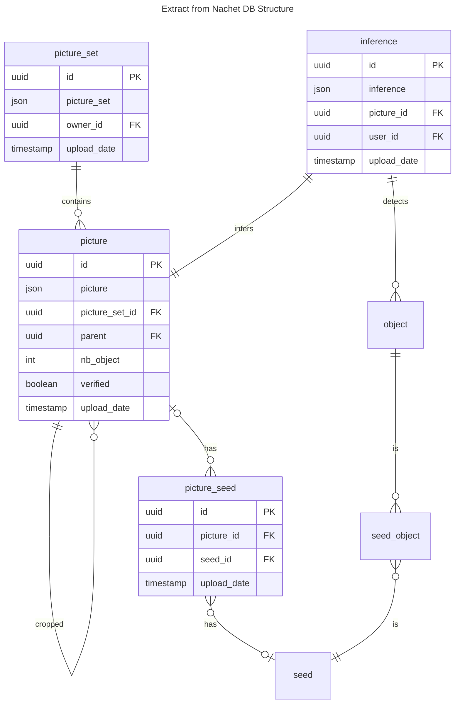
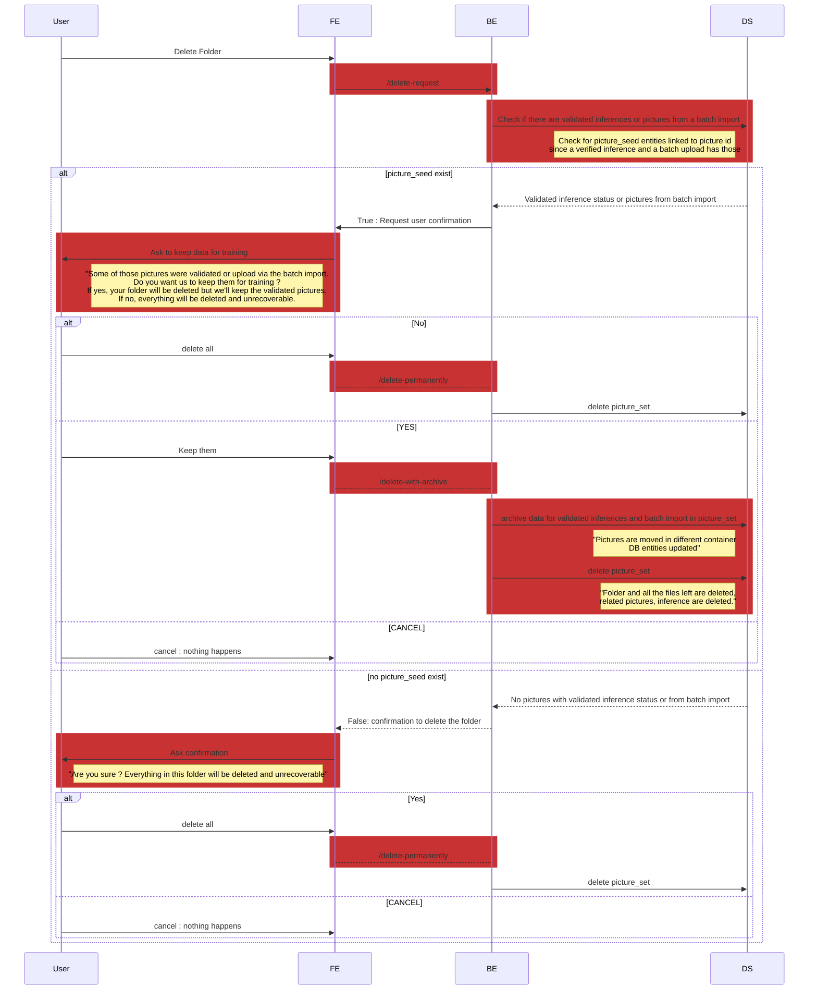
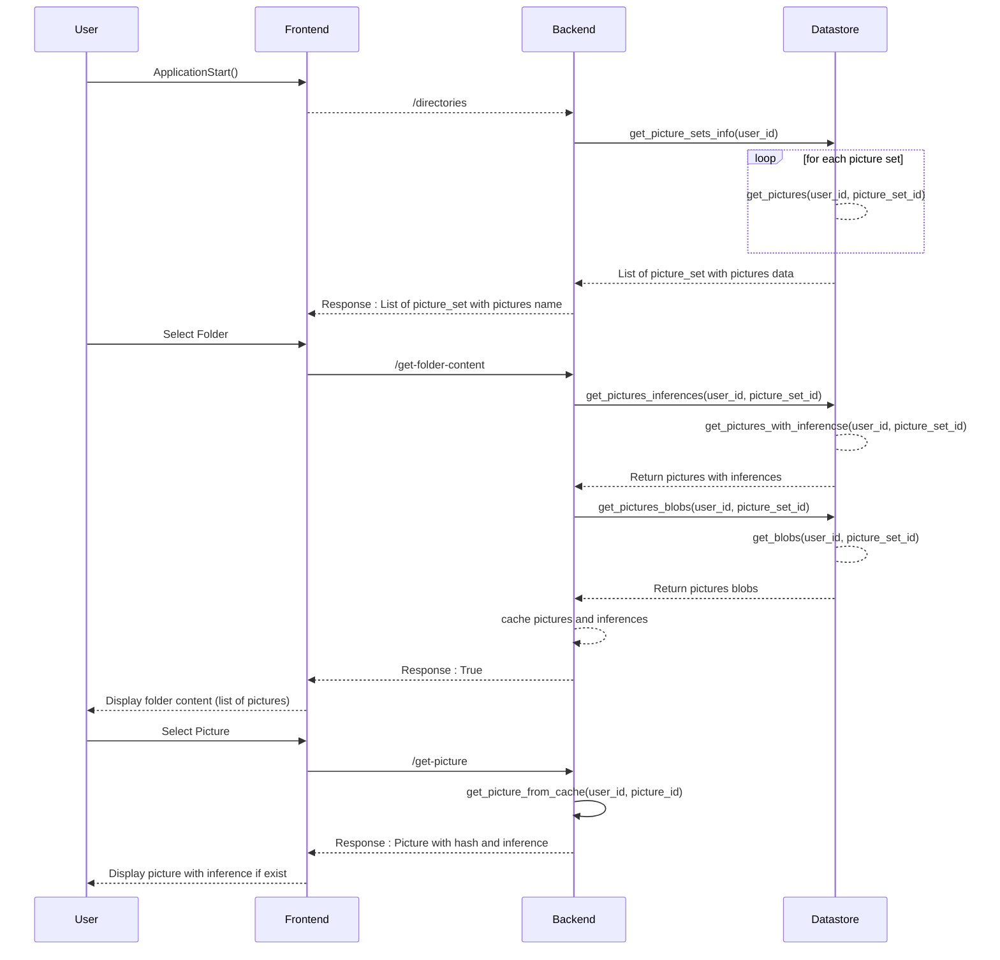

# Manage folders

## Executive summary

A user is able to have a preview of his blob storage container in the Nachet
application. He can have many folders in his container and pictures in it. Since
we have the database, those folders are related to the picture_set table and
each pictures is also saved in the database. Here is the schema of actual
database.

From the nachet application, a user can create and delete folders, so the blob
storage and the database must be correctly updated.

When a folder is created, it takes on a name and is created as a picture_set in
the database and as a folder in the blob storage container of the user.

There are more issues when the user wants to delete a folder. If the folder
contains validated pictures, it may be useful for training purpose, because it
means there is a valid inference associate with each seed on the picture. The
same applies to pictures imported in batches, which have been downloaded for
training purposes. Our solution is to request confirmation from the user, who
can decide to delete pictures from his container but let us save them, or he can
delete everything anyway, for example if there has been a missed click.

Users have asked to be able to access the pictures of folders in the directory
section on frontend. We want them to be able to see each pictures name. Then a
user can select a folder this will get all pictures and their inferences.

## Prerequisites

- The user must be signed in and have an Azure Storage Container
- The backend need to have a connection with the datastore

## Sequence Diagram

### Delete use case

### Get folder content user case

