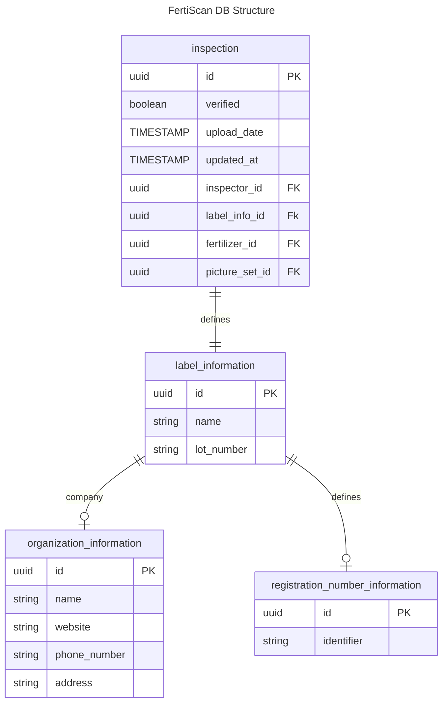
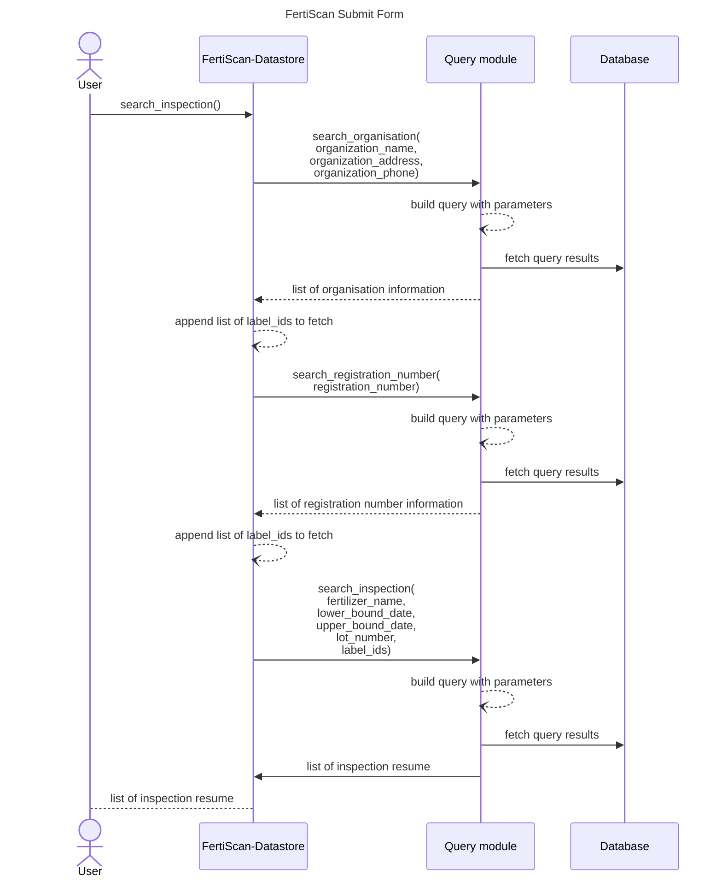

# Search Inspection Documentation

## Context

The User wants to be able to search within the datasets of existing inspection based on the following parameters:

- Fertilizer Name
- Registration number
- Lot number
- A timeframe (lower and upper bounds dates)
- Organization information (the entity responsable for the product)
    - Name
    - Phone number
    - Address

## Rules

We need to establish rules regarding our search. 

### String matching

- The search must allow for a case insensitive search, meaning the capitalisation of words must not be considered. Meaning if you search "ABC in the following dataset

**Dataset**
| ID  | Name |
|-----|------|
| 1   | ABC  |
| 2   | abc  |

**Results**
| ID  | Name |
|-----|------|
| 1   | ABC  |
| 2   | abc  |

- The results must be an exact match to the parameter given, meaning if you search "**ABC**" in the following dataset

**Dataset**
| ID  | Name |
|-----|------|
| 1   | **ABC**  |
| 2   | **ABC**D |
| 3   | **AB**   |
| 4   | abc  |

**Results**
| ID  | Name |
|-----|------|
| 1   | **ABC**  |
| 4   | abc  |

### Multiple Parameters

- For an entry with multiple parameters being evaluated, all parameters are evaluated using a logical "**AND**" therefor they mist all be a match for the entry to be returned as a result. Meaning if you search (**ABC**,**XYZ**) in the following dataset

**Dataset**
| ID  | first name |  Last name |
|-----|------|----| 
| 1   | **ABC**  | **XYZ** |
| 2   | **ABC**  | IJK |
| 3   | DEF  | **XYZ** |
| 4   | DEF  | IJK |

**Results**
| ID  | first name |  Last name |
|-----|------|----| 
| 1   | **ABC**  | **XYZ** |


## Entity Used



## Datastore Signature
``` python
def search_inspection(
    cursor:Cursor,
    fertilizer_name:str,
    reg_number:str,
    lot_number:str,
    inspector_name:str,
    date_of_inspection:str,
    organization_name:str,
    organization_address:str,
    organization_phone:str,
):
```

## Sequence of searching


