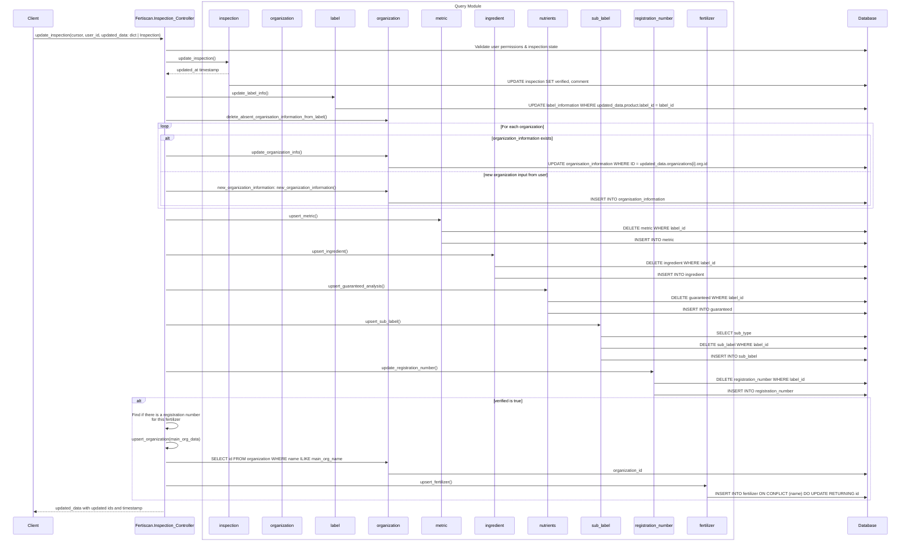
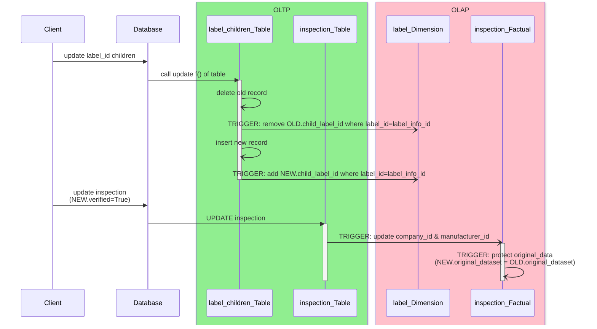

# Updating an Inspection Record

## Sequence Diagram

**Preconditions:**

- The inspection record must exist prior to the update.
- The inspection controller needs to be fetched and used to call `update_inspection()`

**Postconditions:**

- Records for organizations, labels, metrics, ingredients,
  micronutrients, guaranteed analysis, sub-labels, and fertilizers are created
  or updated.
- The existing inspection record is updated with the latest information.
- An updated version of the model is returned

## Triggers to update

These triggers need to be updated to have the OLAP layer fully working. However, this layer is not a necessity to the application and its development as been paused

