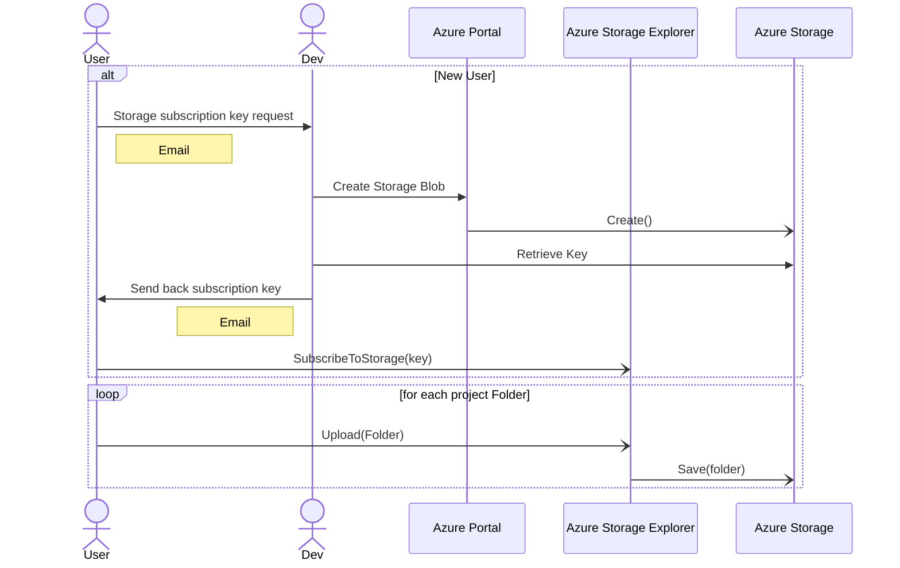
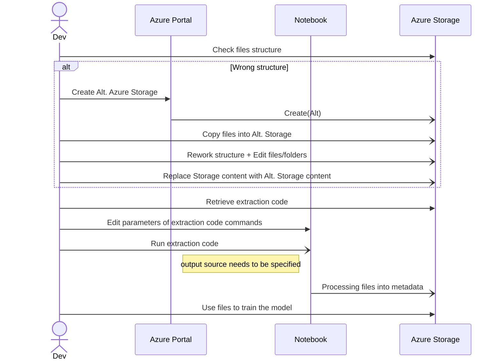

# Metadata importation


## Context

The following documentation detail all the metadata importation for the Nachet
pipeline. We showcase the workflow of everystep taken until the metadata is
usable by our models. We also discuss the expected files structure and other
important component regarding the metadata.


## Workflow: Metadata upload to Azure cloud 

## Sequence of Processing metadata for model



### Legend
|Element|Description|
|-------|-----------|
| User | Anyone wanting to upload data. |
| Dev | AI-Lab Team. |
| Azure Portal | Interface managing Azure's services|
| Azure Storage | Interface storing data in the cloud. |
| Azure Storage Explorer | Application with GUI offering a user friendly access to a Azure Storage without granting full acess To the Azure Services. |
| NoteBook | Azure Service enabling to run code with Azure Storage structure|
| Folder | All project folder should follow the files structure presented bellow. |

## Files Structure

We want to have a standard file structure enable the use of macro to manage the
importation of files in the system. This would allow us to keep track  of the
users uploading data and the content uploaded. Giving a default structure to the
files will allow us to run scripts through those files efficiently. It will also
allow us to populate a DB with the collected information and have a better
insight on our models actual performance. 

### Folder

First, lets take a look at the whole struture of the folder a typical user
wouldlike to upload.We require the user to pack the entire upload into one
singular folder. Within the project folder, multiple subfolder will exist to
enforce an overall structure for the project, while allowing it to be
incremental. The project folder should follow the following structure:
```
project/
│   index.yaml  
│
└───pictures/
│   └───session1/
│   |  │   index.yaml
│   |  │   1.tiff
│   |  │   1.yaml
│   |  |   ...
│   |  └─────────────
│   └───session2/
│      |   ...
│      └─────────────
└──────────────────
```
### Files (.yaml)
#### Index.yaml

The index is the most important file. It will allow us to have all the knowledge
about the user and the categorization of the image.

*Note: The index file located at the root of the project serves as the project
index. Therefore, this index file content will differ from the session index,
however it's structure will stay the same*

```yaml
index:
    projectID: projectID
    uploadDate: timestamp
    clientData:
        clientID: assignedID
        clientName: firstname lastname
        clientOrg: org name
    imageData:
        numberOfImages: number of image to process in the session/project
        uploadCheck: boolean to verify sucessfull upload
    qualityCheck:
        validData: boolean indicating if the data is valid
        errorType: Type of error if the data is erroneous
        dataQualityScore: Overall score given to the data
    seedData: 
        seedID: seedID
        seedFamily: Family name
        seedGenus: Genus name
        seedSpecies: Species name
    seedCharacteristics:
        color: color
        shape: shape
        size: size
        texture: texture
        pattern: pattern
        weight: weight
        seedCount: number of visible seeds
        distinctFeatures: other unique feature of the seed
    sampleInformation:
        geoLocation: coordinates
        region: name of the region/area
        temperature: temperature of the location
        humidity: humidity level
        soil: type of soil
    classificationData:
        model: ID of the used model
        prediction: species predicted by the model
        confidenceScore: score
    clientFeedback:
        correctIdentification: boolean confirming the identification
        additionalNotes: optional notes from the client 
    errorHandling:
        feedback: feedback received on the classification 
        correctionApplied: correction applied based on the received feedback
        errorDetails: details of the error
    auditTrail:
        editedBy: last userID that modified the records
        editDate: date of the last modification
        changeLog: log of all the changes made after the upload
        accessLog: log of all the data access
        privacyFlag: indicator for special privacy concerns
    historicalData:
        comparison: links to historical data of similar seeds
        annotation: optional annotation by experts or the model
    experienceFeedback:
        rating: rating given by the client on his overall experience
        comment: optional entry; comments, suggestion or improvement.
```
#### X.yaml

Each picture should have their .yaml conterpart. This will allow us to run
scripts into the session folder and monitor each picture easily. Each .yaml file
should have the following structure:

*Note: X in this exemple is replacing the picture number or name*

```yaml
X:
    projectID: projectID
    uploadDate: timestamp
    clientData:
        clientID: assignedID
        clientName: firstname lastname
        clientOrg: org name
    imageData:
        imageSource: url or path to the images
        imageFormat: extension (.tiff, .jpg, .png, ...)
        imageSize: image size
        imageResolution: resolution of the images
        imageDescription: description regarding zoom level, angles
        imageChecksum: checksum for image data integrity
        uploadCheck: boolean to verify sucessfull upload
    qualityCheck:
        validData: boolean indicating if the data is valid
        errorType: Type of error if the data is erroneous
        dataQualityScore: Overall score given to the data
```

## Observation

The process of the user requesting the Subscription Access Key and obtaining it
  is not really efficient. The Dev has to manually create Storage space, the key
  is sent by email and no information links the user to the storage space. It
  would be interesting to have a SOP (standard operating procedure) automated by
  a python script. This would enable us to automate the whole process, freeing
  the dev from doing a manual task, we could also incorporate a process to
  insert data into a DB with the python script, enabling us to also collect data
  about the user. Therefore, we would have a database of our users, their keys,
  storage, etc.
