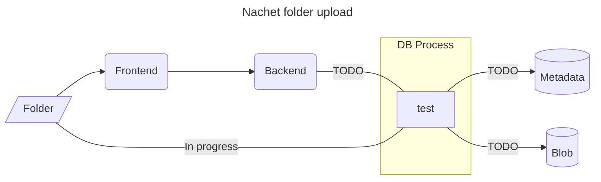
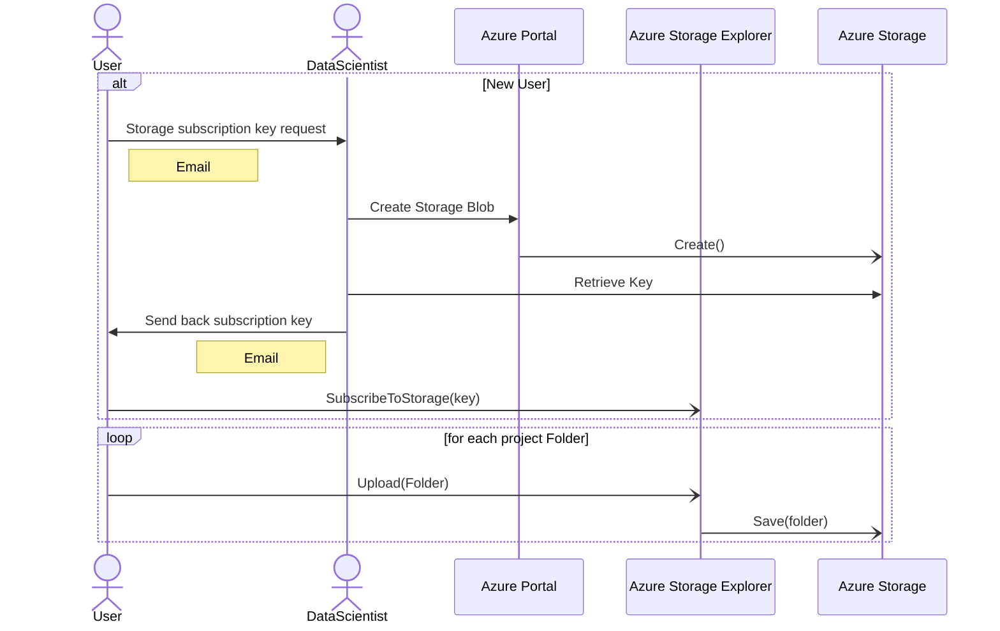
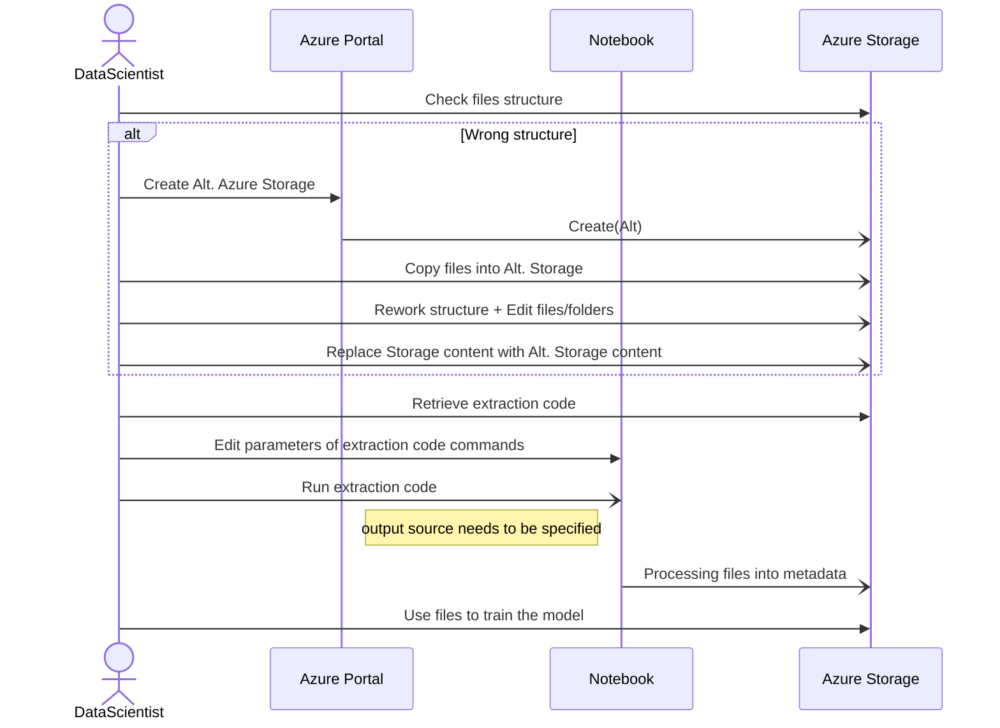

# Metadata importation


## Context

The following documentation detail all the metadata importation for the Nachet
pipeline. We showcase the workflow of everystep taken until the metadata is
usable by our models. We also discuss the expected files structure and other
important component regarding the metadata. 


## Workflow: Metadata upload to Azure cloud 

## Sequence of Processing metadata for model



### Legend
|Element|Description|
|-------|-----------|
| User | Anyone wanting to upload data. |
| DataScientist | Member of the AI-Lab Team. |
| Azure Portal | Interface managing Azure's services|
| Azure Storage | Interface storing data in the cloud. |
| Azure Storage Explorer | Application with GUI offering a user friendly access to a Azure Storage without granting full acess To the Azure Services. |
| NoteBook | Azure Service enabling to run code with Azure Storage structure|
| Folder | All project folder should follow the files structure presented bellow. |

## Files Structure

We want to have a standard file structure enable the use of macro to manage the
importation of files in the system. This would allow us to keep track  of the
users uploading data and the content uploaded. Giving a default structure to the
files will allow us to run scripts through those files efficiently. It will also
allow us to populate a DB with the collected information and have a better
insight on our models actual performance. 

### Folder

First, lets take a look at the whole struture of the folder a typical user
wouldlike to upload.We require the user to pack the entire upload into one
singular folder. Within the project folder, multiple subfolder will exist to
enforce an overall structure for the project, while allowing it to be
incremental. The project folder should follow the following structure:
```
project/
│   index.yaml  
│
└───pictures/
│   └───session1/
│   |  │   index.yaml
│   |  │   1.tiff
│   |  │   1.yaml
│   |  |   ...
│   |  └─────────────
│   └───session2/
│      |   ...
│      └─────────────
└──────────────────
```
### Files (.yaml)
#### [Index.yaml](index.yaml)

The index is the most important file. It will allow us to have all the knowledge
about the user and the categorization of the image.

*Note: The index file located at the root of the project serves as the project
index. Therefore, this index file content will differ from the session index,
however it's structure will stay the same*


#### [X.yaml](X.yaml)

Each picture should have their .yaml conterpart. This will allow us to run
scripts into the session folder and monitor each picture easily. Each .yaml file
should have the following structure:

*Note: X in this exemple is replacing the picture number or name*

## Observation

The process of the user requesting the Subscription Access Key and obtaining it
  is not really efficient. The Dev has to manually create Storage space, the key
  is sent by email and no information links the user to the storage space. It
  would be interesting to have a SOP (standard operating procedure) automated by
  a python script. This would enable us to automate the whole process, freeing
  the dev from doing a manual task, we could also incorporate a process to
  insert data into a DB with the python script, enabling us to also collect data
  about the user. Therefore, we would have a database of our users, their keys,
  storage, etc.
