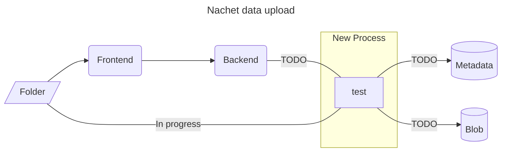
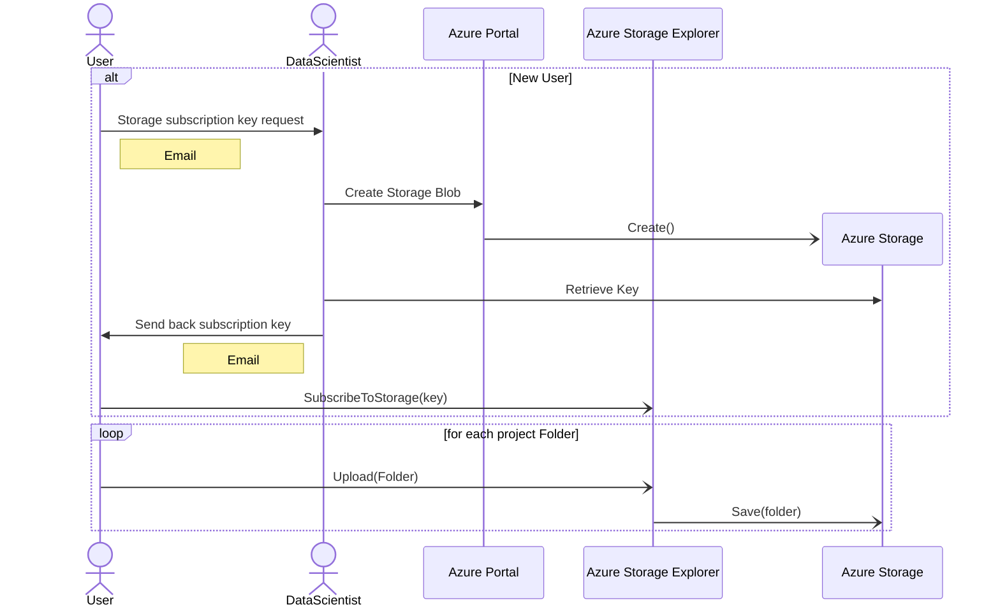
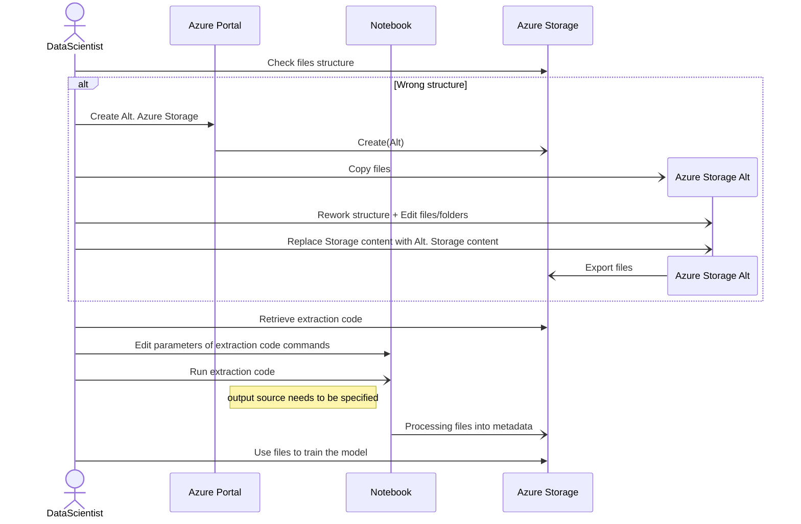
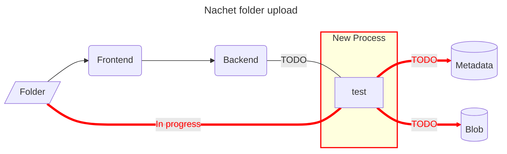
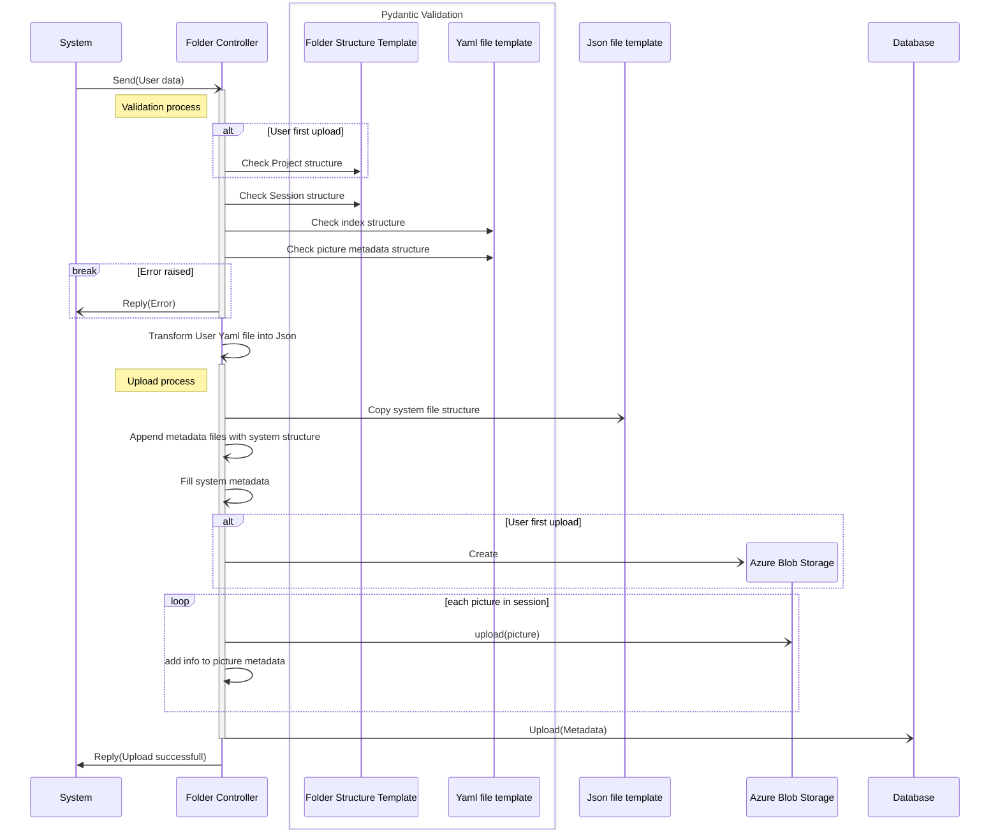
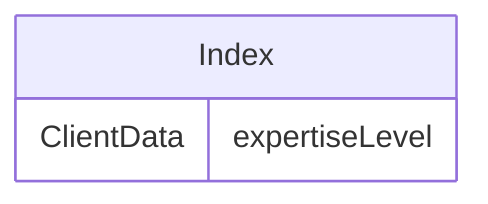

# Metadata importation


## Context

The following documentation provide an overview of the metadata importation
process for the Nachet pipeline. We outline each steps of the workflow,
illustrating how data progresses until it becomes usable by our models.
Additionally, the upcoming process are showcased with the expected files
structure. 

As shown above, we are currently working on a process to validate the files
uploaded to the cloud. However, since Nachet is still a work in progress, here's
the current workflow for our user to upload their images for the models.

## Workflow: Metadata upload to Azure cloud 

This workflow showcase the 2 options that a user will face to upload data. The
first one being he's a first time user. Therefore, the current process for a
first time user is to contact the AI-Lab team and subscribe to the Blob storage
with a given subscription key.
## Sequence of processing metadata for model


This sequence illustrate the manual task done by our team to maintain the storage of user's data. 
### Legend
| Element                | Description                                                                                                                |
| ---------------------- | -------------------------------------------------------------------------------------------------------------------------- |
| User                   | Anyone wanting to upload data.                                                                                             |
| DataScientist          | Member of the AI-Lab Team.                                                                                                 |
| Azure Portal           | Interface managing Azure's services                                                                                        |
| Azure Storage          | Interface storing data in the cloud.                                                                                       |
| Azure Storage Explorer | Application with GUI offering a user friendly access to a Azure Storage without granting full acess To the Azure Services. |
| NoteBook               | Azure Service enabling to run code with Azure Storage structure                                                            |
| Folder                 | All project folder should follow the files structure presented bellow.                                                     |

## Development

As explained in the context we aim to implement a folder structure for user
uploads. This approach would allow to us add a data structure validator using
[Pydantic](https://docs.pydantic.dev/latest/). By implementing a validator, we
will be able to remove all manual metadata maintenance. Once the validation
process is complete, the upload process will come into play, enabling the
distribution of the files between the BLOB storage and a PostgreSQL database. 

 We are currently working on such process, which will be added to the  backend
 part of nachet once it is finished.


*Note that the bottom process wont be present on the deployed versions of Nachet*
## New Process


This sequence encapsulate the expected tasks of the new feature.  
### Files Structure

We aim to have a standard file structure to enable the use of a script to manage
the importation of files into the system. This statarized structure will allow
us to keep track  of the users uploads, the metadata feedback. By providing a
default structure for the files, we can run scripts through those files and
efficiently add/edit data within. Moreover, this approach will facilitate the
population of a database with the collected information enabling us to have a
better insight on our models actual performance. 

#### Folder

Lets begin by examinating the overall struture of the folder that a typical user
will be expected to upload. We require that users pack their entire upload into
a singular folder. Within the project folder, multiple subfolder will be present
to enforce an overall structure for the project, while allowing futur addition.
The project folder should adhere to the following structure:
```
project/
│   index.yaml  
│
└───pictures/
│   └───session1/
│   |  │   index.yaml
│   |  │   1.tiff
│   |  │   1.yaml
│   |  |   ...
│   |  └─────────────
│   └───session2/
│      |   ...
│      └─────────────
└──────────────────
```
#### Files (.yaml)
##### [Index.yaml](index.yaml)

The index is an most important file. It will allow us to have all the knowledge
about the user and the project/session.




##### [picture.yaml](picture.yaml)

Each picture should have their .yaml conterpart. This will allow us to run
scripts into the session folder and monitor each picture easily.

*Note: 'picture' in this exemple is replacing the picture number or name of the .tiff file*

## Consequences
  Implementing this structure and introducing the new backend features in Nachet
  will result in the following impact:
- **Automation of file structure maintenance:** This process will autonomously
  manage the file structure, eliminating the need for manual maintenance and
  reducing workload for the AI-Lab team.

- **Streamlined subscription key management:** The new feature will eliminate
  the need for email communication between users and the AI-Lab team for
  subscription keys. The system may automatically create and connect to the
  appropriate BLOB storage without user intervention. Consequently, manual
  creation of storage by the AI-Lab team will be unnecessary, and all keys will
  be securely stored in the database.

- **Enhanced security:** The removal of email exchanges between users and the
  development team represents a substantial improvement in security protocols.

- **Improved model tracking and training:** Storing user metadata will enable
  more effective tracking of model performance and facilitate better training
  strategies.

- **Automated metadata enrichment:** The process will enable the automatic
  addition of additional information to metadata, enhancing the depth of
  insights available.
  
Overall, this new feature will empowers the AI-Lav team to have better control
over the content fed to the models and ensures improved tool maintenance
capabilities in the future.