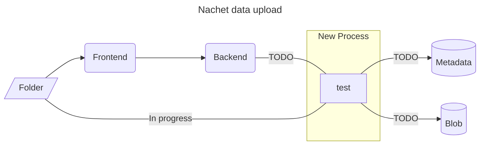
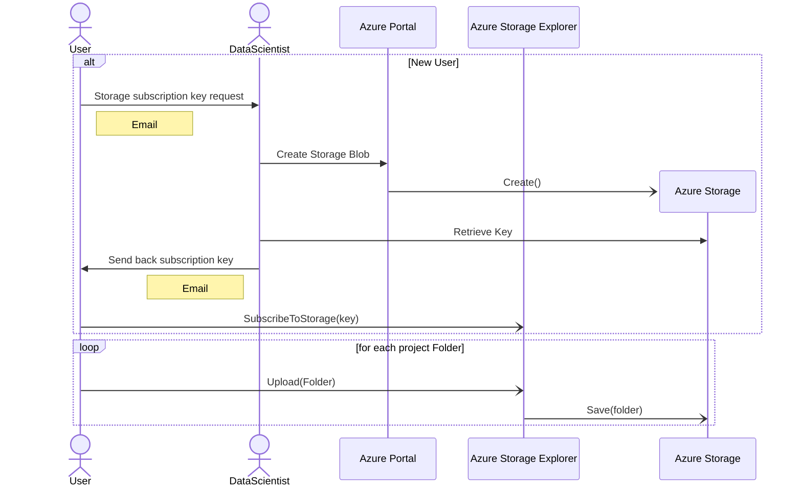
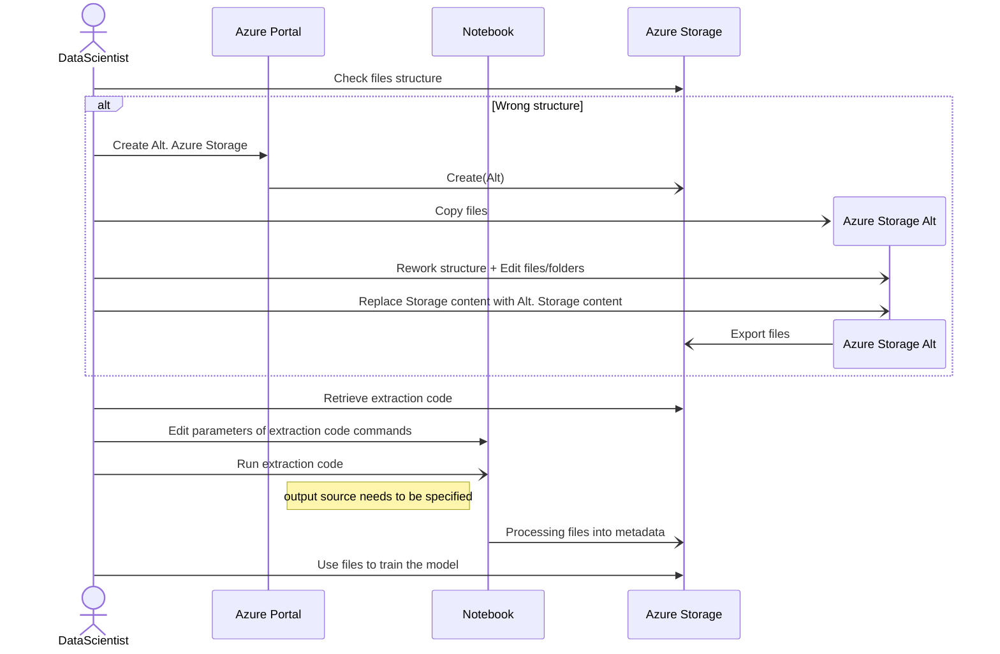
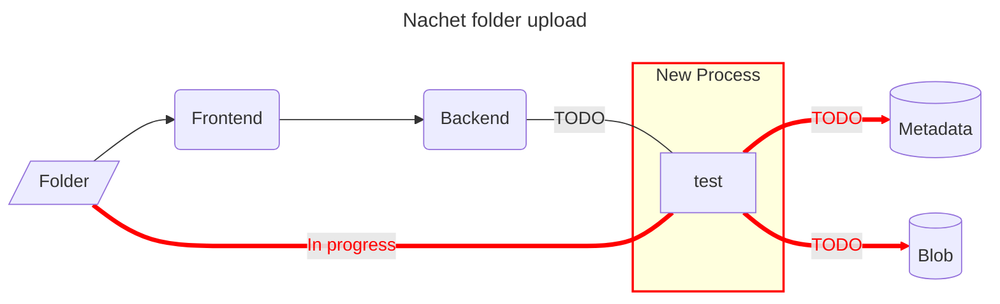
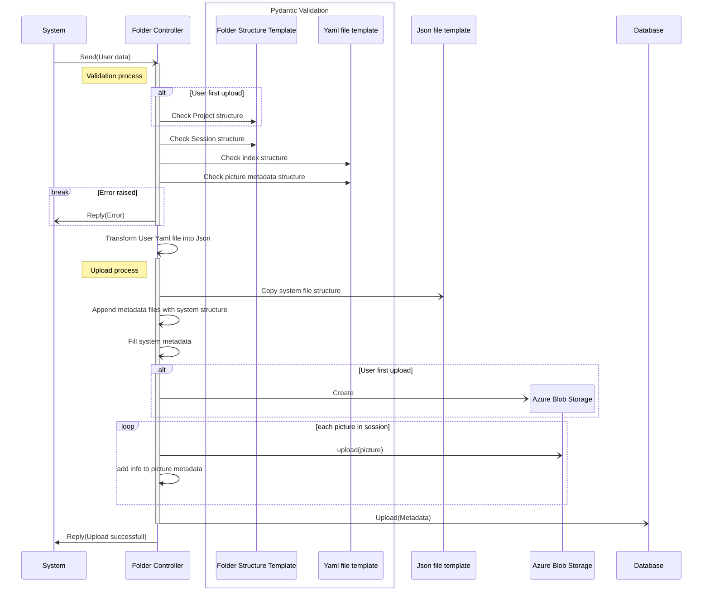
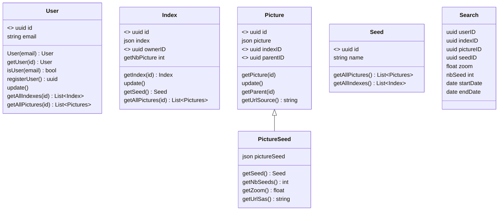
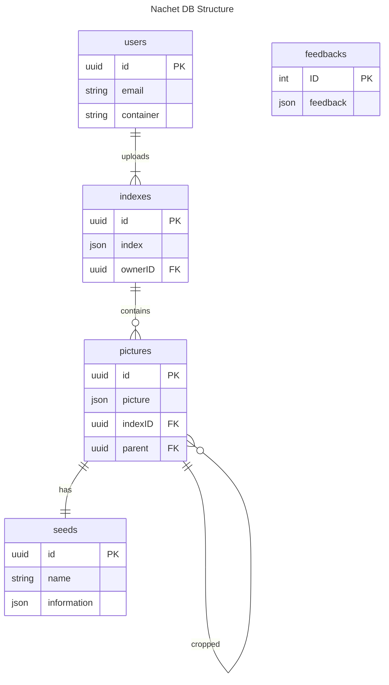

# Metadata importation


## Context

The following documentation provide an overview of the metadata importation
process for the Nachet pipeline. We outline each steps of the workflow,
illustrating how data progresses until it becomes usable by our models.
Additionally, the upcoming process are showcased with the expected files
structure. 

As shown above, we are currently working on a process to validate the files
uploaded to the cloud. However, since Nachet is still a work in progress, here's
the current workflow for our user to upload their images for the models.

## Workflow: Metadata upload to Azure cloud 

This workflow showcase the 2 options that a user will face to upload data. The
first one being he's a first time user. Therefore, the current process for a
first time user is to contact the AI-Lab team and subscribe to the Blob storage
with a given subscription key.
## Sequence of processing metadata for model


This sequence illustrate the manual task done by our team to maintain the
storage of user's data. 
### Legend
| Element                | Description                                                                                                                |
| ---------------------- | -------------------------------------------------------------------------------------------------------------------------- |
| User                   | Anyone wanting to upload data.                                                                                             |
| DataScientist          | Member of the AI-Lab Team.                                                                                                 |
| Azure Portal           | Interface managing Azure's services                                                                                        |
| Azure Storage          | Interface storing data in the cloud.                                                                                       |
| Azure Storage Explorer | Application with GUI offering a user friendly access to a Azure Storage without granting full acess To the Azure Services. |
| NoteBook               | Azure Service enabling to run code with Azure Storage structure                                                            |
| Folder                 | All project folder should follow the files structure presented bellow.                                                     |

## Development

As explained in the context we aim to implement a folder structure for user
uploads. This approach would allow to us add a data structure validator using
[Pydantic](https://docs.pydantic.dev/latest/). By implementing a validator, we
will be able to remove all manual metadata maintenance. Once the validation
process is complete, the upload process will come into play, enabling the
distribution of the files between the BLOB storage and a PostgreSQL database. 

 We are currently working on such process, which will be added to the  backend
 part of nachet once it is finished.


*Note that the bottom process wont be present on the deployed versions of
Nachet*
## New Process


This sequence encapsulate the expected tasks of the new feature. 
### Queries
To communicate with the database and perform the request, we will need to build
a structure representing the schema.


### Requests (Backend)

Nachet backend will need the following requests to be able to handle the new
process.

*Note the name of the requests are subject to change and are currently meant to
be explicit about the purpose of the call*

#### User requests
| Name                | Description                                                                                                                |
| ---------------------- | -------------------------------------------------------------------------------------------------------------------------- |
| isUserRegister                   |    Is this user uuid stored in the database                                                                                         |
| getUserID          | Retrieve the uuid of the current user                                                                                                 |
| userRegister | This will serve as creating an instance of the user in the DB. I assume this will also be used as a way to create the containers if the user is an expert and has the responsability to upload a data set for testing the models|

#### Upload requests

| Name                | Description                                                                                                                |
| ---------------------- | -------------------------------------------------------------------------------------------------------------------------- |
| ValidateDataSet                   |      Scans the folder uploaded by the user and checks if the standard structure is respected.                                                                                        |
| ValidateIndexes | Check if there is an index file for each sub folders with pictures, and if all the keys have a value associated to them (This does not verify the value)|
| ValidateIndexContent | This validates that a single index has all his fields correctly filled out (input type check, input is valid, seed info is ok, ...) |
| ValidateFileCount | This scans each subfolders and verify that the file count correspond to the expected amount of file, based on the number of images in the index metadata.  |
|**CreateNewSeed** | This request will depend on either we receive a populated DB from our partners. If not, if the  see submitted by is a new one, we will have to create an instance of it in the DB.  |
| ValidatePictureTandem | This validates that each picture have their corresponding YAML counterpart.<br>*(If the number of seeds and zoom field are not removed from picture.yaml)* |
| ValidatePictureContent | This will not be a request related to the DB or metadata, but it will be necessary to check if the picture uploaded is related to Nachet's content and it's properties are ok (size, format, etc.)
| MaliciousPictureCheck|This will not be a request related to the DB or metadata, but it is imperative to check the picture file and make sure it's a picture and not a malicious file with hidden code or content into it. |
| uploadDataSet          | This request happen once the data set receive the ok to all the validation checks. It serves as uploading all the folder to diverse endpoint depending on the file type.                                                                                                 |
#### Validation Errors
Here's a list of the errors that can be returned turing the validation of the
upload | Name                | Description
| | ---------------------- |
--------------------------------------------------------------------------------------------------------------------------
| | Wrong structure                   |      This type if error indicate the
folder uploaded by the user doesn't follow the required structure.
| | Missing Index          | An Index is missing which means the whole folder of
picture couldn't be processed. This might stop the upload process as a whole
| |Index content | A specific Index either has missing fields or unexpected
values | |Unexpected file | Based on the value given by the user within the
index, there are more files present in the subfolder than expected  | |Missing
file | Based on the value given by the user within the index, there are less
picture files than expected| | <picture.yml> content | This error indicate
there's an issue with one of the data field in the file called 'picture.yml'
<br>*(If the number of seeds and zoom field are not removed from picture.yaml)*
|
### Files Structure

We aim to have a standard file structure to enable the use of a script to manage
the importation of files into the system. This statarized structure will allow
us to keep track  of the users uploads, the metadata feedback. By providing a
default structure for the files, we can run scripts through those files and
efficiently add/edit data within. Moreover, this approach will facilitate the
population of a database with the collected information enabling us to have a
better insight on our models actual performance. 

#### Folder

Lets begin by examinating the overall struture of the folder that a typical user
will be expected to upload. We require that users pack their entire upload into
a singular folder. Within the project folder, multiple subfolder will be present
to enforce an overall structure for the project, while allowing futur addition.
The project folder should adhere to the following structure:
```
project/
│   index.yaml  
│
└───pictures/
│   └───session1/
│   |  │   index.yaml
│   |  │   1.tiff
│   |  │   1.yaml
│   |  |   ...
│   |  └─────────────
│   └───session2/
│      |   ...
│      └─────────────
└──────────────────
```
#### Files (.yaml)
##### [Index.yaml](index.yaml)

The index is an most important file. It will allow us to have all the knowledge
about the user and the project/session.


##### [picture.yaml](picture.yaml)

Each picture should have their .yaml conterpart. This will allow us to run
scripts into the session folder and monitor each picture easily.

*Note: 'picture' in this exemple is replacing the picture number or name of the
.tiff file*
## Database
We plan on storing the metadata of the user's files in a postgreSQL Database.
The database should have the following structure: 

## Blob Storage

Finally the picture uploaded by the users will need to be stored in a blob
storage. Therefore we are using a Azure blob Storage account which currently
contains a list of containers either for the users upload or our Data scientists
training sets. The current structure needs to be revised and a standarized
structure needs to pe applied for the futur of Nachet. 

```
Storage account
│     
│
└───container 
│   └───folder/
│   |  │   1.tiff
│   |  │   2.tiff
│   |  |   ...
│   |  └─────────────
│   └───folder/
│      |   ...
│      └─────────────
└──────────────────
```

## Consequences
  Implementing this structure and introducing the new backend features in Nachet
  will result in the following impact:
- **Automation of file structure maintenance:** This process will autonomously
  manage the file structure, eliminating the need for manual maintenance and
  reducing workload for the AI-Lab team.

- **Streamlined subscription key management:** The new feature will eliminate
  the need for email communication between users and the AI-Lab team for
  subscription keys. The system may automatically create and connect to the
  appropriate BLOB storage without user intervention. Consequently, manual
  creation of storage by the AI-Lab team will be unnecessary, and all keys will
  be securely stored in the database.

- **Enhanced security:** The removal of email exchanges between users and the
  development team represents a substantial improvement in security protocols.

- **Improved model tracking and training:** Storing user metadata will enable
  more effective tracking of model performance and facilitate better training
  strategies.

- **Automated metadata enrichment:** The process will enable the automatic
  addition of additional information to metadata, enhancing the depth of
  insights available.
  
Overall, this new feature will empowers the AI-Lav team to have better control
over the content fed to the models and ensures improved tool maintenance
capabilities in the future.